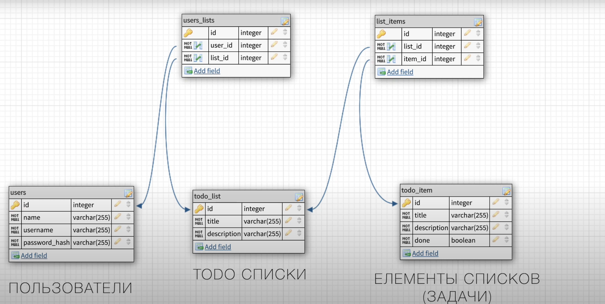

## Структура API

POST /AUTH/SIGN-UP  
POST /AUTH/SIGN-IN  

GET /LISTS  
GET /LISTS/{ID}  
POST /LISTS  
PUT /LISTS/{ID}  
DELETE /LISTS/{ID}  
GET /LISTS/{ID}/ITEMS   
POST /LISTS/{ID}/ITEMS   

### Схема БД
